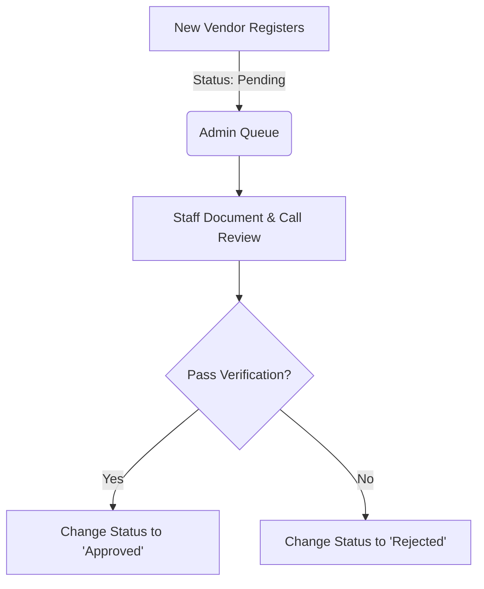
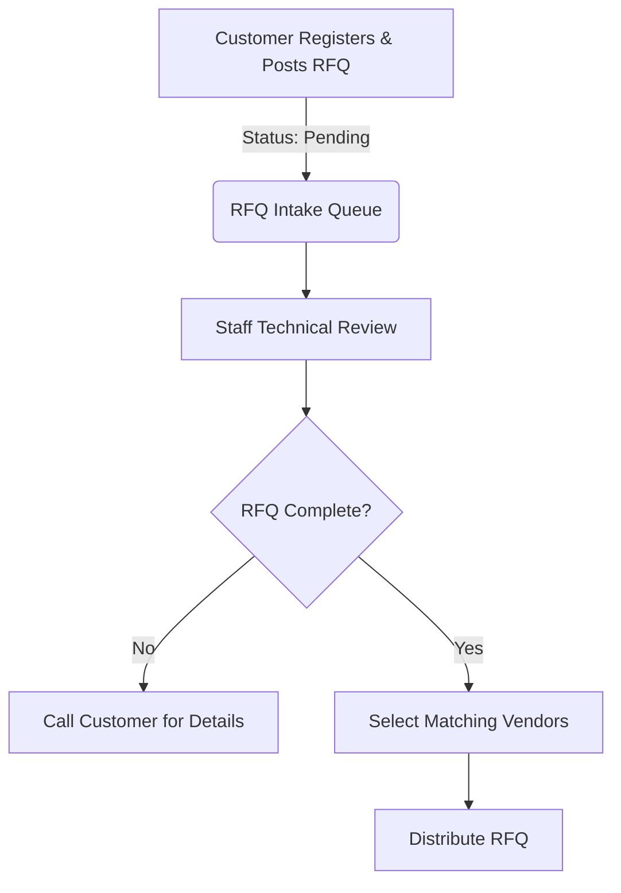
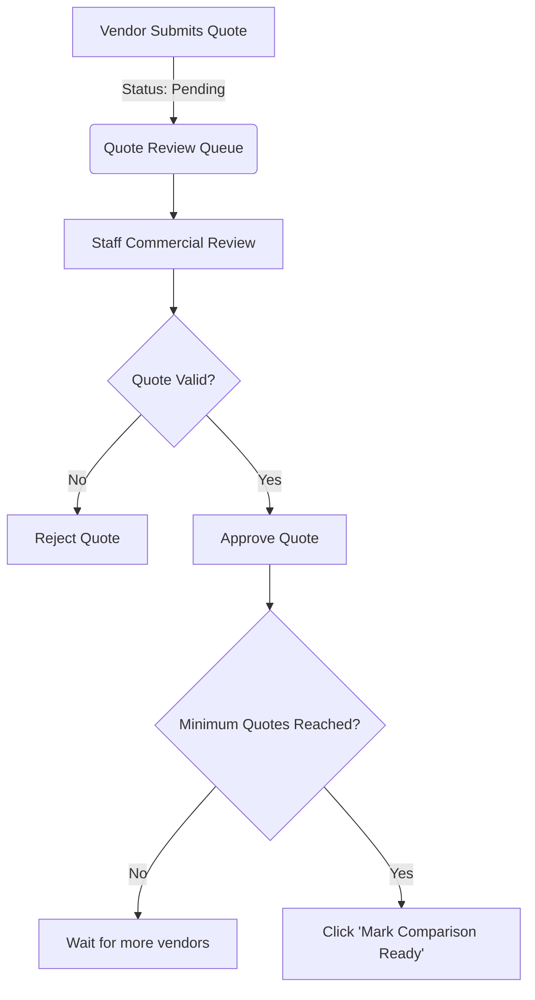
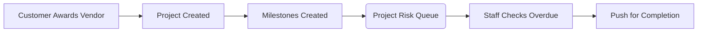
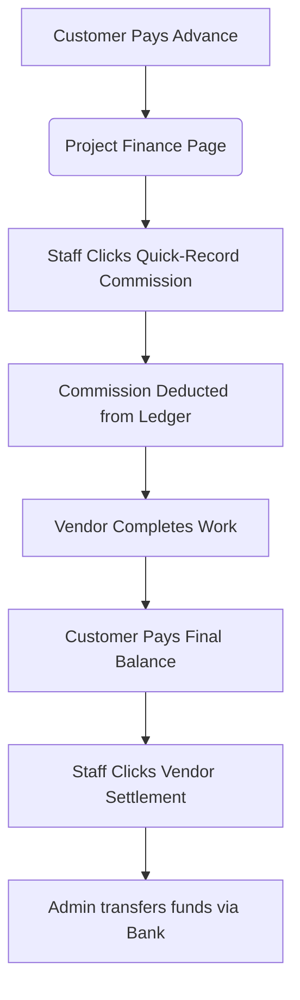

# RKISPro Standard Operating Procedure (SOP)

**Document Purpose:** This SOP defines the exact, step-by-step daily workflows for RKISPro Administrative Staff. It ensures consistent quality control, secure vendor isolation, and accurate financial tracking across the marketplace.

**Target Audience:** RKISPro Operations Team, Marketplace Admins, Finance Managers.

---

## 1. SOP: Vendor Onboarding & Verification

**Objective:** Ensure only capable, legitimate vendors are allowed to view customer drawings and submit quotes.

### Process Flow

### Step-by-Step Procedure
1. **Daily Check:** Log in to the Admin Dashboard and locate the **Pending Vendor Approvals** stat. Click into the Vendor Queue.
2. **Profile Review:** Open the pending vendor's profile. You must review:
   - **Contact Info:** Is the phone number and owner name valid?
   - **Machinery & Capacity:** Does the machinery match the claimed services? (e.g., if they claim CNC machining, do they list a CNC machine?)
   - **Location:** Note their base of operations (Bilaspur, Raipur, etc.).
3. **Verification Call (Mandatory):** Call the vendor using the provided phone number.
   - *Script Note:* "Hello, this is RKISPro. We are verifying your vendor application. Can you confirm your current production capacity and primary services?"
4. **System Action:** 
   - If verified: Click **Approve**. The vendor can now be selected to receive RFQs.
   - If fraudulent or unverified: Click **Reject**. Add internal notes specifying why.

---

## 2. SOP: Customer Onboarding & RFQ Intake

**Objective:** Validate customer requirements before exposing them to our vendor network to maintain a high signal-to-noise ratio.

### Process Flow

### Step-by-Step Procedure
1. **Daily Check:** Monitor the **RFQ Intake Queue** on the Admin Dashboard.
2. **Technical Review:** Open any `Pending` RFQ. 
   - Ensure **Drawings/Files** are attached and accessible.
   - Verify the **Deadline** is realistic for the requested service.
   - Check if **Material Type** and **Quantity** are clearly stated.
3. **Customer Follow-up (If Required):** If the RFQ lacks detail, call the customer immediately to clarify specs. Do NOT distribute a vague RFQ.
4. **Distribution:** 
   - Scroll down to the vendor selection list.
   - Use the filter inputs (Location, Services, Machinery) to narrow down the list.
   - Check the boxes next to 3-5 highly relevant, **Approved** vendors.
   - Click **Send RFQ to Selected Vendors**. 
   - *Outcome:* The RFQ status changes to `Distributed`. Vendors receive an SMS/Email to quote.

---

## 3. SOP: Quote Sourcing & Comparison Enablement

**Objective:** Review vendor pricing for anomalies and release them to the customer simultaneously to ensure fair bidding.

### Process Flow

### Step-by-Step Procedure
1. **Daily Check:** Monitor the **Quote Review Queue**.
2. **Commercial Review:** For each pending quote, review:
   - **Amount:** Is it suspiciously low or absurdly high compared to market rates?
   - **Timeline:** Can they meet the customer's deadline?
   - **Notes:** Did the vendor add specific conditions?
3. **Approve/Reject:**
   - Click **Approve** if the quote is sound.
   - Click **Reject** (with an optional note) if the quote is invalid. The vendor will be notified to try again.
4. **Gate Release (Critical Step):** 
   - Customers *cannot* see approved quotes immediately.
   - Once you have secured at least 2-3 good, Approved quotes for a specific RFQ, click the **"Approve & Mark Comparison Ready"** button.
   - *Outcome:* The customer is notified, and the "Award Vendor" button is unlocked on their dashboard.

---

## 4. SOP: Project Awarding & Milestone Monitoring

**Objective:** Ensure active projects do not stall and vendors meet their delivery deadlines.

### Process Flow

### Step-by-Step Procedure
1. **Creation:** Once a customer awards a quote, a `Project` is automatically generated.
2. **Milestone Setup:** As an Admin, ensure the project has clear milestones (e.g., "Raw Material Sourced", "Fabrication 50%", "Delivery").
3. **Daily Risk Check:** Monitor the **Project Risk Queue** on your dashboard.
   - This queue automatically counts projects where a milestone's `Due Date` has passed, but `Completed At` is still empty.
4. **Intervention:** If a project appears in the Risk Queue, immediately call the Vendor for a status update. Update the milestone status accordingly.

---

## 5. SOP: Financial Settlement (Commission & Payouts)

**Objective:** Accurately capture RKISPro's 3% commission upfront and ensure vendors are paid out securely without manual math errors.

### Process Flow

### Step-by-Step Procedure
1. **Advance Collection:** When a project starts, the customer pays the Advance.
2. **Record Commission (Mandatory First Step):**
   - Go to the **Finance** tab of the project.
   - Locate the gold **Quick-Record Commission** card.
   - Verify the amount (it automatically calculates 3% of the total project value).
   - Click **Record Commission as Received**. This securely logs our profit into the ledger.
3. **Vendor Payout (End of Project):**
   - When it is time to pay the vendor, go to the green **Vendor Settlement Action** card on the Finance page.
   - The card will display the exact **Net Vendor Payout** (Advance Received minus our Commission).
   - Open your corporate banking portal and transfer the exact `Net Vendor Payout` amount to the vendor's account.
   - Take the UTR/Reference number from the bank, paste it into the reference field on the card, and click **Record Vendor Payout**.
   - *Outcome:* The ledger balances out, and the vendor's dashboard updates to show they have been paid.
